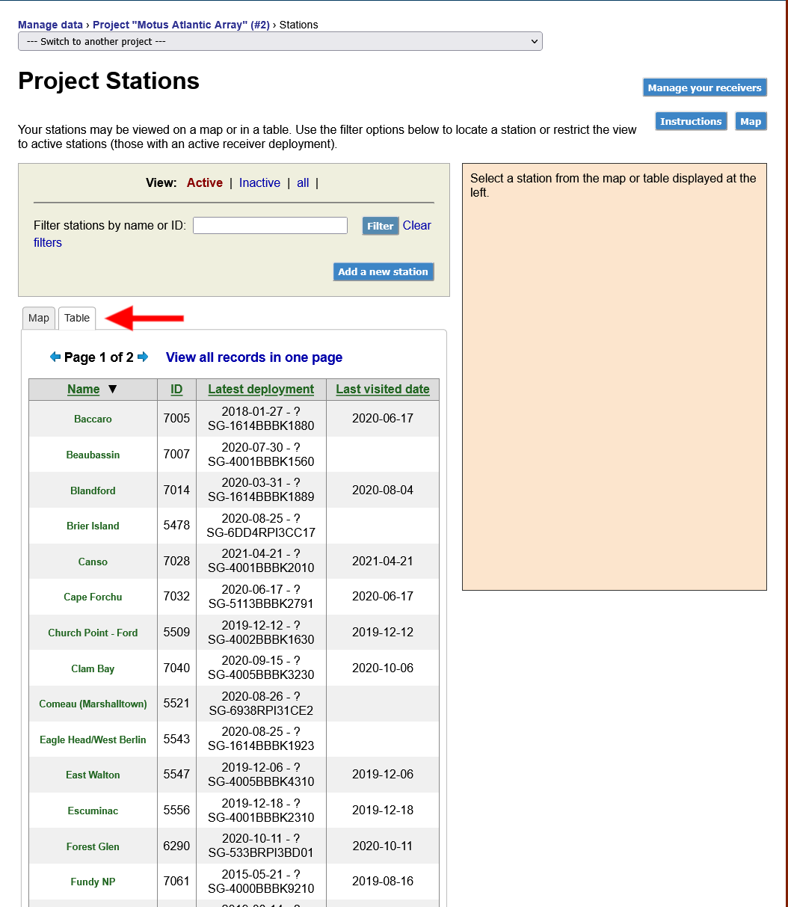

# Station Management

This section pertains to the management of station metadata. To learn more about station selection and deployment, see our chapter on stations:


[Broken link](broken-reference)


In this chapter you will find:

* ****[**Introduction to Stations**](station-management.md#introducing...stations)****
  * ****[**I have used Motus before there were 'stations'. What's different?**](station-management.md#i-have-used-motus-before-stations-were-introduced.-what-exactly-is-different-from-before)****
* ****[**How to Manage Stations**](station-management.md#managing-stations)****

## Introducing...Stations

A Motus station is a single location where Motus receiver equipment is or has been deployed. A station ties together all the different deployments (i.e., 'configurations') that a location might have had. For instance, if a new antenna was added to a station that was already deployed or if that station had a new computer installed, it will all be recorded under the same location and name. Not only does this help us better organise our database, id also makes metadata management much more efficient and intuitive for Motus collaborators.

### I have used Motus before Stations were introduced. What exactly is different from before?

If you're already familiar with Motus, it won't take much to understand why we're introducing this new level of organisation. Fortunately, your analyses won't need to change since we're recycling a pre-existing variable to create this new one. Essentially, what used to be known as 'sites,' a more general term with no restriction on geographic area or number of active Motus deployments, is now being converted into a single 'station' which can only be in one location (unless mobile) and can only have a single active deployment at a time. In addition, 'receiver deployments' are now going to be 'station deployments'. The coordinates and landowner information will also be associated with stations rather than deployments.

Previously, most Motus collaborators used sites for the same purpose we intend to use stations anyways and landowners are already associated with sites. For this reason, we do not anticipate any major disruptions as a result of this change.

All this being said, we've had to upgrade the management interface to allow for stations. Now, instead of managing "receivers" and "receiver deployments", you will be managing "stations" and "station deployments". A small change, but a more intuitive one from the perspective of collaborators who actually deploy the equipment. See our section on [**Managing Stations**](station-management.md#managing-stations) to learn about this new workflow.

### What are the advantages of using stations?

By introducing stations, we're now able to string together deployments across multiple receivers based on where they were deployed in a consistent manner. Previously, researchers would have to use the station's name to link together data from multiple receivers which could be frustrating when names were not consistent between deployments or when two locations had similar names.

Further, we are due to release a new data exploration tool next year which will depend on having stations defined in order to correctly organise data.&#x20;

### Why didn't we use 'Stations' since the beginning?

The Motus database was first organised from the perspective of data processing. That is, to store detections based on the serial number of the computer (i.e., "receiver") that collected those data. However, we also wanted to keep track of different station configurations, hence "receiver deployments" were born. For most of Motus' history, 'receivers' and 'receiver deployments' were good enough to define all the metadata associated with a Motus receiver, and in fact it still is. But as Motus grew with time station management became more and more cumbersome, making a definition for stations an obvious choice. In other words, you could say our hindsight is 20-20.

## Managing Stations

Stations are the backbone of Motus. They form the network which makes data sharing possible. To maximise the utility of Motus, metadata associated with stations must be kept accurate and up to date.

### View **project** stations

To view a map or table of stations associated with your project(s), go to [**Manage Data > Manage Stations**](https://beta.motus.org/data/project/stations)**.**

You can toggle your view between a map and table by clicking on the tabs above the map/table.

### **Filter stations**

By default, only active stations will be displayed. To view inactive stations or all stations together, click on the appropriate link above the table or map.

You can also filter stations by name or ID using the text input above the map.

&#x20;

### **View station deployments**

Using the map, you can click on any station to see it's deployments. When viewing a table, click on a row to see it's deployments.

After clicking on a station, its details will appear in the panel on the right. This includes details about the station (status, location, and landowner) as well as the current and past deployments.

********

### **Terminate a deployment**

With a station selected, click on the button labelled '**Terminate this** **deployment**' in the right panel just above the deployment history.&#x20;

You will be asked to provide the date and time that the deployment was terminated.

****


Only one deployment can be active at a station at any given time. This means any active deployment must be terminated before creating a new one.&#x20;


### **Add a deployment**

With a station selected, click on the button labelled '**Create a new deployment**' in the right panel just above the deployment history.

****
