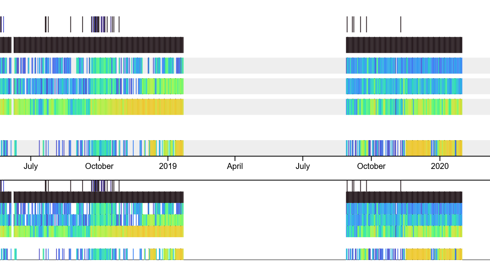

# Station Management

This section pertains to the management of station metadata. To learn more about station selection and deployment, see our chapter on stations:


[Broken link](broken-reference)


In this chapter you will find:

* ****[**Introduction to Stations**](station-management.md#introducing...stations)****
* ****[**How to Manage Stations**](station-management.md#managing-stations)****

## Introducing...Stations

A Motus station is a single location where Motus receiver equipment is or has been deployed. A station ties together all the different deployments (i.e., 'configurations') that a location might have had. For instance, if a new antenna was added to a station that was already deployed or if that station had a new computer installed, it will all be recorded under the same location and name. Not only does this help us better organise our database, id also makes metadata management much more efficient and intuitive for Motus collaborators.

### I have used Motus before Stations were introduced. What exactly is different from before?

If you're already familiar with Motus, it won't take much to understand why we're introducing this new level of organisation. Fortunately, your analyses won't need to change since we're recycling a pre-existing variable to create this new one. Essentially, what used to be known as 'sites,' a more general term with no restriction on geographic area or number of active Motus deployments, is now being converted into a single 'station' which can only be in one location (unless mobile) and can only have a single active deployment at a time. In addition, 'receiver deployments' are now going to be 'station deployments'. The coordinates and landowner information will also be associated with stations rather than deployments.

Previously, most Motus collaborators used sites for the same purpose we intend to use stations anyways and landowners are already associated with sites. For this reason, we do not anticipate any major disruptions as a result of this change.

All this being said, we've had to upgrade the management interface to allow for stations. Now, instead of managing "receivers" and "receiver deployments", you will be managing "stations" and "station deployments". A small change, but a more intuitive one from the perspective of collaborators who actually deploy the equipment. See our section on [**Managing Stations**](station-management.md#managing-stations) to learn about this new workflow.

### What are the advantages of using stations?

By introducing stations, we're now able to string together deployments across multiple receivers based on where they were deployed in a consistent manner. Previously, researchers would have to use the station's name to link together data from multiple receivers which could be frustrating when names were not consistent between deployments or when two locations had similar names.

Further, we are due to release a new data exploration tool next year which will depend on having stations defined in order to correctly organise data.&#x20;

### Why haven't we use 'Stations' since the beginning?

The Motus database was first organised from the perspective of data processing. That is, to store detections based on the serial number of the computer (i.e., "receiver") that collected those data. However, we also wanted to keep track of different station configurations, hence "receiver deployments" were born. For most of Motus' history, 'receivers' and 'receiver deployments' were good enough to define all the metadata associated with a Motus receiver, and in fact it still is. But as Motus grew with time station management became more and more cumbersome, making a definition for stations an obvious choice. In other words, you could say our hindsight is 20-20.

## Managing Stations

Every location where a Motus receiver is deployed needs to be recorded as a 'station' in our database. This section covers the following topics:

* ****[**View project stations**](station-management.md#view-project-stations)****
* ****[**Filter stations**](station-management.md#filter-stations)****
* ****[**View station deployments**](station-management.md#view-station-deployments)****
* ****[**Add a new station**](station-management.md#add-a-new-station)****
* ****[**Modify a station**](station-management.md#modify-a-station)****
* ****[**Terminate a deployment**](station-management.md#terminate-a-deployment)****
* ****[**Add a new deployment**](station-management.md#add-a-deployment)****

### View **project** stations

To view a map or table of stations associated with your project(s), go to [**Manage Data > Manage Stations**](https://beta.motus.org/data/project/stations)**.**

You can toggle your view between a map and table by clicking on the tabs above the map/table.

.png>).png>)

### **Filter stations**

By default, only active stations will be displayed. To view inactive stations or all stations together, click on the appropriate link above the table or map.

You can also filter stations by name or ID using the text input above the map.

&#x20;

### **View station deployments**

Using the map, you can click on any station to see it's deployments. When viewing a table, click on a row to see it's deployments.

After clicking on a station, its details will appear in the panel on the right. This includes details about the station (status, location, and landowner) as well as the current and past deployments.

********

### **Add a new station**

Click on the button labelled 'Add a new station'. This will open a dialog box with the following required fields:

1. **Name:** the name of the station. It's most helpful if this based on a local name.
2. **Prospective start date:** if the station is or was already deployed, enter a current or past date. If the station hasn't yet been deployed, enter the date you estimate to have it installed. If you do not have active plans to deploy a station here, leave this field blank.
3. **Location:** drag the pin around on the map to specify the location of this station, or use the latitude/longitude field below the map. **Mobile stations** should have their location as the start/end point of their 'typical' track.&#x20;
4. **Comments:** this is helpful for entering access notes or if the stations is not yet installed you may describe the plans to install and the location here.
5. **Landowners:** you may select one or more landowner in this list. If the landowner is not present in the list, click the button labelled 'Manage your project landowners' to add a new one.

********.png>)****

### **Modify a station**

To modify a station, first select a station from the map or table and then click on 'Modify properties' from the panel on the right. See [**Add a new station**](station-management.md#add-a-new-station) **** for information about the options present here.

********

### **Terminate a deployment**

With a station selected, click on the button labelled '**Terminate this** **deployment**' in the right panel just above the deployment history.&#x20;

You will be asked to provide the date and time that the deployment was terminated.

****


Only one deployment can be active at a station at any given time. This means any active deployment must be terminated before creating a new one.&#x20;


### **Add a deployment**

#### Step 1: Click on '**Create a new deployment'**

With a station selected, click on the button labelled '**Create a new deployment**' in the right panel just above the deployment history.

#### Step 2: **Enter** start date

You will be presented with a dialog box asking for the **deployment start date and time** as well as a couple check boxes which allow you to choose whether to copy metadata from the previous deployment.

.png>)

#### Step 3: Select a receiver

If you choose to select a new receiver (by unchecking the box labelled 'Use most recent receiver' in previous step), you will be presented with a table of all receivers registered to the project.&#x20;

To select a receiver, click on the button 'Deploy this receiver' in the row corresponding to the receiver serial number. This button will not be visible on rows with receivers that are actively deployed.

You can click on a row to view further details about the receiver, such as its deployment history.

Click on 'Add a receiver' above the table to add a new receiver if it's not present.&#x20;

#### Step 4: Enter deployment configuration

Regardless of whether you have a new antenna configuration, it is helpful to enter notes at this step using the provided text area.

If you _are_ entering a new antenna configuration, you will also need to select the mounting structure (i.e. "type").

To enter antenna information, use the form at the bottom of the page and enter antennas one row at a time. The following columns are required:

* **Dongle type:** this is the radio device plugged into USB ports on certain receivers. There is one for each antenna. If you are using built-in 434 MHz radios on the **CTT SensorStation**, please select "Integrated (CTT SensorStation). If you are using a **Lotek SRX- series receiver,** please select "Integrated (Lotek SRX)".
* **Port**: this is either the USB or radio port that the antenna is plugged in to. This is very important to keep accurate since it will be used to correlate antenna directions to tag hits. Keep in mind that for CTT SensorStations, the built-in 434 MHz radios are labelled with the "L" prefix.
* **Frequency:** the antenna frequency. This is usually selected for you.
* **Type:** the antenna type. This is helpful for keeping track of antenna ranges as well as differences between equipment manufactures.
* **Magnetic OR true bearing:** the direction the antenna is facing. We tend to recommend magnetic bearing since not all compasses show declination. A phone compass typically displays the magentic declination unless otherwise specified. This field can be blank for antennas pointing vertically (e.g.; omni antennas).
* **Angle:** this is only required for non-horizontal antennas (e.g.; omni antennas). This option can be found under the 'advanced antenna properties' tab.

After entering your antenna information, you can verify the directions are correct by clicking on the button labelled 'View antenna map,' located just below the antenna table.

************

**Step 5: Click 'Save and exit'**

Once you are finished entering data, verify all the information is accurate and then click 'Save' or 'Save and exit'. You're done!
