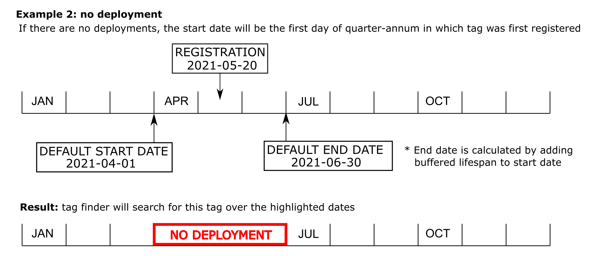
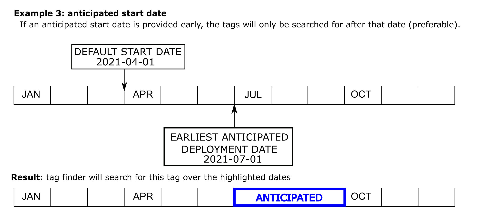

# Tag Metadata

Metadata informs Motus when to look for tags in raw detection data, when tag codes can be reissued, helps ensure that the permanent data archive is accurate and complete, and makes data presentable to the public.

## Required tag metadata

### Tag registration

All tags used with Motus [must first be registered.](tag-registration.md)

### Tag deployments

The table below outlines the minimum requirements for tag metadata to acquire detections from Motus.

| Name                           |                           Importance                          | Description                                                                                                        |
| ------------------------------ | :-----------------------------------------------------------: | ------------------------------------------------------------------------------------------------------------------ |
| Deployment start date and time |          <mark style="color:red;">**Required**</mark>         | The time when the tag was activated and attached to an animal                                                      |
| Species                        |          <mark style="color:red;">**Required**</mark>         | The species the tag was attached to. For tests, please do not enter a species and check the 'test deployment' box. |
| Latitude and longitude         |          <mark style="color:red;">**Required**</mark>         | The location where the animal was released with the tag attached and activated                                     |
| Federal band (ring) number     | <mark style="color:red;">**Required (when available)**</mark> | The band number or ring number of the bird or bat. Insect tag numbers are optional.                                |
| Other measurements             |       <mark style="color:green;">**Recommended**</mark>       | Any additional measurements of the tagged animal, such as weight, age, and sex, should also be included.           |


**Do not** enter a deployment date unless the tag was actually recovered and deactivated. Otherwise, Motus will automatically calculate the end date of the tag using a generous buffer in case the tag lasts longer than anticipated.


## Why metadata is so important

Metadata is a critical part of the Motus infrastructure. Not only does it inform our algorithms which search for tag detections on when to look for specific tags, it also helps make sense of data that are presented to the public. As the Motus community grows, the importance of accurate and up to date metadata grows exponentially.

### How metadata is used to detect tags

Motus stations receive radio signals from Lotek radio transmitters (i.e.; tags attached to animals) as a series of pulses that are all on the same frequency. It's the specific timing between these radio pulses that encodes the ID number of these tags (see [**How Tags Work**](../../tags/how-tags-work.md)). We decode Lotek tags from radio signals ourselves using a complex algorithm called [_**tag finder**_](../../tags/appendix/tag-finder.md). This algorithm takes into account the possibility of multiple tags being present and emitting a signal at the same time.

To improve the performance and accuracy of _tag finder_, Motus only search for tags that are known to be active at any given time. To accomplish this, _tag finder_ references a master list of all registered tags along with the dates when they were active (‘_deployments’_). Occasionally, some tag detections are missed because \_tag finder \_doesn't know that certain tags are active, usually because of missing or inaccurate metadata in our system.

## How does Motus know when tags are active?

Most tags are deployed on animals and never seen again, so most tag deployments will have a start date, but no end date. This is the correct way to enter deployment metadata if a tag is not retrieved again after deployment as it allows our system to calculate the end date on its own. This end date is calculated as the predicted lifespan (provided to us by the manufacturer) plus an additional 50% to account for unusually long-lasting tags. This predicted lifespan is calculated based on the tag model number, so it’s important to ensure that information is correct as well. The examples below use a theoretical tag with a predicted lifespan of 60 days.

### Default deployment date

In reality, it’s impractical to enter tag deployment metadata immediately upon releasing each animal, so we have built in a couple safe guards to help mitigate this issue. The first is that tags will be searched for by Motus immediately upon registration if no deployment exists for those tags. The registration date has historically been recorded as the _quarter-annum_, so tag finder will act as though each tag was deployed on the first day of that _quarter-annum_. Not desirable, but better than nothing.

### Anticipated deployment date

Default deployment dates are only present as a backup in case the researcher has forgotten to include their _earliest_ _anticipated start date_ during tag registration. An anticipated start date is basically the earliest day on which the researcher plans to deploy tags. This should provide ample time to update the tag metadata after the field season is over.

### Deployed tags

Once a tag has been deployed, it's deployment metadata should be updated to reflect the real deployment date. Otherwise, tag finder might think the tag expired too early.


**Remember:** providing an anticipated deployment date will buy you more time before you need to update these data.


### Undeployed tags 

Tags that were not deployed during the anticipated tagging period can be stored for later use, but Motus needs to know about these. If there are anticipated tag deployments for any of the tags that weren't actually deployed, those tags might be reissued which can result in ambiguous detections that cannot be used for analysis. This is because there are a limited number of Motus tag IDs so they have to be recycled from time to time. We make our master list of tag deployments available to the tag manufacturers so they know which ones are currently in use.


Undeployed tags should be stored with the correct conditions. See [**Tag Storage**](../../tags/tag-storage.md) for more information.


## Consequences of bad metadata

Bad metadata to be information related to deployments which is either missing or inaccurate. We can use the example scenario above to predict what might happen when metadata isn't kept up to date.

* If there is no deployment data for a tag, _tag finder_ will assume the tag has expired and will stop searching for it long before it should. In our example, the default deployment period has no overlap with the actual active period, meaning it will only search for the tag before it was actually ever deployed. Therefore, no detections would exist for this tag.
* If only an anticipated deployment date exists, there may be some overlap with the actual deployment period, but there could still be a lot of data missing from the end of the tag lifespan.
* If there are left over tags after the field season or if a tag is recovered and the existing deployments aren't terminated, manufacturers might reissue the tags which can result in ambiguous detections. That means there could be two tags deployed at the same time that appear identical to each other deployed at the same time, making it difficult or impossible to accurately identify the individual.

