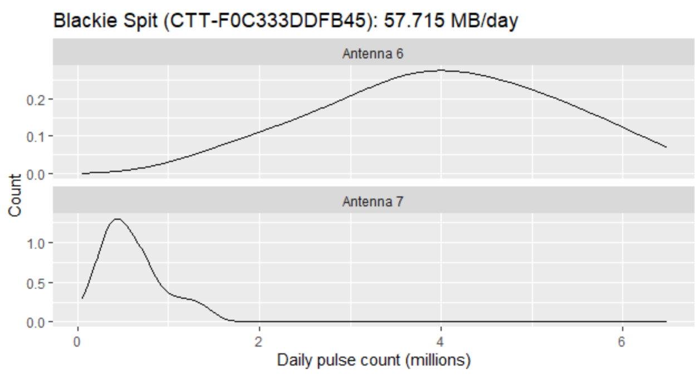
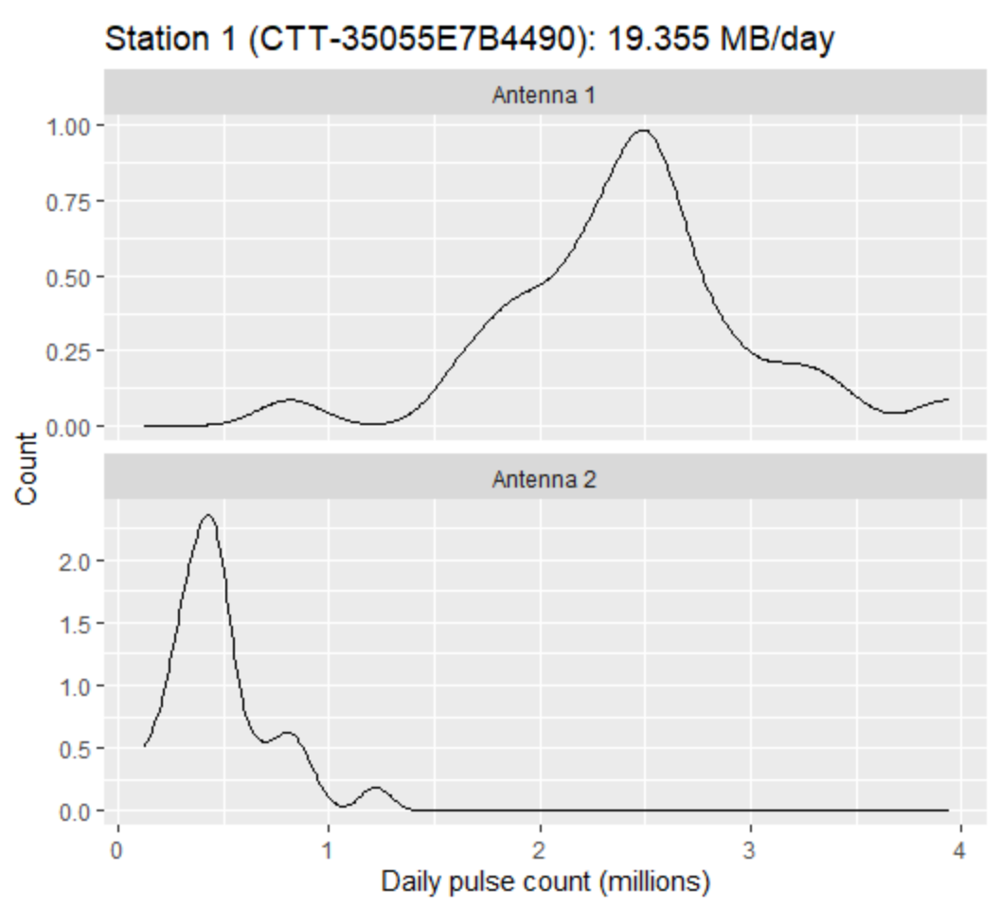

# Noisy Stations

Motus stations autonomously listen for radio signals on designated frequencies depending on where they are in the world. In some environments there is a lot of radio noise, or interference. Diagnosing noise sources is an important step in maintaining data quality and can also significantly reduce the amount of data being recorded and potentially transmitted through expensive cellular or satellite networks. Below we summarize the best ways to identify which stations may be considered noisy, how to identify which antennas may be causing problems, and suggestions on how to resolve noise issues.

The following mostly pertains to stand alone Sensorgnomes and SensorStations with antennas operating on 166.380 MHz, 150.100 MHz, and 151.500 MHz.

## **Addressing excessive noise**

Raw data from Lotek radio tags consist of long lists of time-stamped radio pulses. Four precisely-timed pulses (within 1.5 ms) are needed to identify a [Lotek tag ID](https://docs.motus.org/tagguide/how-tags-work#lotek-radio-tags), but these pulses must be picked out from the surrounding noise environment. We consider noise to be any kind of radio pulse that is received by a station that was not produced by the intended target (i.e., a radio tag). Not only can this noise mask the pulses of real tags—preventing a receiver from picking it up—it can also produce signals that resemble real tags, resulting in a false positive detection. Excessive noise can be especially problematic for networked receivers that are using cellular or satellite connections. A single receiver experiencing excessive noise on a single antenna can easily produce over a GigaByte of data in a single month, resulting in $100’s in data charges.

### Bandpass Filter

A bandpass filter is devices which attaches to a coaxial cable that further filters the signal being received. These are typically passive devices (no external power required) and operate over a narrow range of frequencies. For antennas listening to 166.380 MHz, we recommend the following device:

[https://www.scannermaster.com/BPF\_VHF\_Band\_Pass\_Filter\_p/24-531041.htm](https://www.scannermaster.com/BPF\_VHF\_Band\_Pass\_Filter\_p/24-531041.htm)

### **Noise Sources**

Noise can be present for a variety of reasons. Anthropogenic noise can be the most problematic as it is more likely to follow a repeated pattern, which is required to mimic a tag pulse. In most cases, noise tends to be problematic on only certain antennas, not all of them. Sometimes simply changing the direction of an antenna can solve the problem; however, it may also be necessary to disconnect problematic antennas until the issue can be resolved. Sometimes damaged hardware, such as cracked coaxial cables, faulty radio dongle, or poor connections can also introduce noise into the system. In the case of a hardware issue, changing the antenna direction should have a negligible effect on the level of noise detected.

## **Identifying excessive antenna noise using R**

Using the Motus R Package, summaries of raw radio pulses can be downloaded for each antenna and then compared to one another based on the number of pulses received each day. The threshold for the number of daily pulses depends on how much data is considered ‘too much’, but generally most antennas record fewer than 1 million radio pulses a day.

The following density plot shows a one-month period of data collected at Blackie Spit in British Columbia when nearly 2 GB of data were recorded over that time. As you can see, antenna 6 has been recording well over 1 million pulses a day, averaging around 4 million a day, whereas antenna 7 has a far more reasonable number of pulses. Based on this information, we can conclude that data from antenna 6 should be scrutinized, and then modified and/or removed to increase data quality, or reduce the risk of data overages.



### R Script

You can produce your own plots like the one above using the code below. If you have not used the Motus R Package in the past we recommend reviewing Chapters 1-3 of the [Motus R Book](https://motus.org/MotusRBook/index.html) before proceeding.

This script uses the 'pulseCounts' table from the receiver detections database downloaded from the R package. To use this script, you must specify:

**Line 11:** Directory of where Motus databases are stored on your computer (files ending with ".motus")

**Line 17:** Receiver metadata, including:

* Serial number of the receiver
* Name that you want printed in the plot title
* The size of the raw data files for the time period that you are reviewing (in MegaBytes)
* The start date of the time period you are reviewing (YYYY-MM-DD)
* The end date of the time period you are reviewing (YYYY-MM-DD)

```
# Required packages
library(motus)
library(tidyverse)
library(lubridate)

# Set the timezone to UTC
Sys.setenv(tz = "GMT")

# Select the directory where databases are stored on your computer
dir <- 'E:/Data/'

# Identify the receiver(s) you wish to plot
recvs.df <- tribble(
# Serial number       Name on plot    (MB)    Start date    End date
  ~recvID,            ~name,          ~size,   ~dtStart,     ~dtEnd,
  'CTT-F0C333DDFB45', 'Blackie Spit', 1789.18, "2021-07-01", "2021-08-01"
  ) %>%
  mutate(dtStart = as.Date(dtStart),
         dtEnd = as.Date(dtEnd),
         MB.daily = (size / as.integer(dtEnd-dtStart)) %>% round(digits = 3)) %>%
  as.data.frame()

# Run the code below and login using your Motus account credentials.
recvs.df %>% by(seq_len(nrow(recvs.df)),
  function(d) {
    message("Downloading data for ", d$recvID, " (", d$name, ")")
    
    sql <- tagme(projRecv = d$recvID, new = !file.exists(paste0(dir, d$recvID, '.motus')), update = T, forceMeta = F, dir = dir)
    
    message("Finished downloading")
    
    pulses.df <- sql %>% tbl('pulseCounts') %>% collect() %>% as_tibble() %>% 
      mutate(ts = as.POSIXct(hourBin*60*60, origin = '1970-01-01'))
    
    daily.pulses.df <- pulses.df %>% 
      mutate(day = ts %>% day,
             month = (ts %>% month),
             year = (ts %>% year)) %>%
      group_by(day, year, month, ant) %>%
      summarise(ts = min(ts),
                count = sum(count, na.rm = T))
    
    message("Found ", daily.pulses.df %>%
              filter(ts > d$dtStart, ts < d$dtEnd) %>% nrow(), " pulses.")
    
    message("Making the plot...")
    
    p <- daily.pulses.df %>%
      filter(ts > d$dtStart, ts < d$dtEnd) %>%
      ggplot(aes(count/1e+06))+
      geom_density()+
      facet_wrap(.~paste0("Antenna ", ant), ncol = 1, scales = "free_y")+
      labs(x = "Daily pulse count (millions)",
           y = "Count", 
           title = paste0(d$name, " (", d$recvID, "): ", d$MB.daily, " MB/day"))
    
    message("Done.")
    p   
    
  })
```

## How to fix a problematic antenna

Once a problem station/antenna has been identified we have a number of choices:

### Quick Fixes

1. Disconnect the station from the cell network entirely (this is not ideal, but a quick fix). For instructions on disconnecting SensorStations, refer to [the SensorStation manual](https://store.celltracktech.com/pages/installation-guides).
2. Confirm framerate of radio dongles by connecting to the receiver and checking the [Web Interface](https://docs.motus.org/sensorgnome/webinterface#what-im-doing-now-and-devices-panes). Dongle framerate should be around 48 KHz. If you don’t see that try [reflashing the FunCube firmware](https://docs.motus.org/sensorgnome/appendix/fcdfirmware).
3. Disconnect the problem antenna. Noisy antennas may be damaged or otherwise not collect data of the same quality as other, less noisy antennas so taking them offline should not be a major impediment to the system. Collaborators may want to examine how many 'good' detections are detected on noisy antennas opposed to others before deciding to disconnect. This will be a bigger deal for stations with active tags nearby, but should not be a problem for most passive listening stations.
4. Try installing [band-pass-filters](https://en.wikipedia.org/wiki/Band-pass\_filter) which can reduce interference outside a desired band. These have been used successfully in areas with heavy marine traffic, such as Sable Island, Nova Scotia.
   * [137-174 MHz​ Band](https://www.scannermaster.com/BPF\_VHF\_Band\_Pass\_Filter\_p/24-531041.htm)

### Harder Fixes

1. Identify the source of the interference and attempt to aim the problem antenna away from that source. Visual inspection of the landscape, or experimentation with a manual receiver can often help to identify a source of interference.
2. Use antenna analyzer to verify the antenna still performs within a reasonable threshold. _Instructions to come._
3. Use the process of elimination to identify whether it is a hardware problem. Replace all components of the problem antenna one at a time: USB cable; Radio Dongle; Coaxial Cable; Antenna. Checks for signs of cracks in the coaxial cable or loose/rusty connections. [**More information.**](broken-reference)
4. Replace the antenna altogether.

## More examples

Below are a few more examples of noisy antennas.

**Noisy Antenna:** 1

**Noisy Antenna:** 2, maybe 1 as well

**Noisy Antenna:** 2
