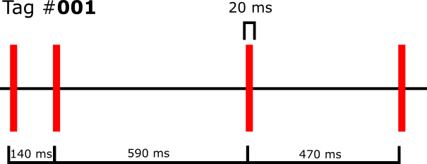

# How Tags Work

## What is a tag or radio transmitter?

When most people use the word “tag” usually they’re talking about a clothing label or a sticker on a banana, but more generally it’s a type of marker which identifies the item in some way. This is no different from the way we use the word except in this instance we are using a radio transmitter as a marker. A **radio transmitter** is an electronic device which sends information through radio waves, similar to radio stations used to broadcast music to your car. The radio transmitters used in the Motus Wildlife Tracking Network are specially designed to be as small and lightweight as possible, allowing scientists to attach them to small animals without harming them. The signal transmitted by these transmitters, or “tags”, contains a special code which uniquely identifies the device. This signal is picked up by radio receiver stations which are placed in strategic locations across the globe. To Learn more about these receiver stations, **click here**.

## What types of tags are there?

There are two main types of signals transmitted by radio tags used in the Motus Wildlife Tracking Network. Tags produced by Lotek transmit a pulse-position modulated (PPM) signal with 4 pulses at 166.380 MHz; tags produced by CTT transmit a 64-bit Frequency shift keying signal at 434 MHz. See the sections below for more information on each tag make.

## Lotek Radio Tags

To encode a unique ID, Lotek radio tags transmit a series of pulses at 166.380 MHz (in the Americas; other regions differ).

### Tag Pulses

A tag pulse consists of a single, 20 millisecond (ms) long radio transmission sent by the tag. Individual pulses are the raw data that SensorGnome receivers record.

### Pulse Intervals and Bursts

A pulse interval is the time between two successive pulses. It is measured in milliseconds (ms). Tags emit four pulses at a time, together making a **burst**. The pulse interval is what we use to encode the **Lotek Tag ID**. This is measured to a high level of precision, allowing for just 1.5 ms of variation summed across all pulse intervals in a burst.

_Note: these pulse intervals do not reflect properties of real tags are intended for demonstration purposes only._

### Burst Intervals

A burst interval is the timing between successive bursts. It is measured in seconds.

The burst interval and **Lotek Tag ID** combined are used to encode the **Motus Tag ID**. To avoid ambiguous detections, burst intervals cannot be integer multiples of one another. Therefore, all burst intervals must be _prime factors._ Keep in mind there must be two successive bursts to measure the burst interval and associate a **Motus Tag ID**, but [some bursts can be skipped.](https://github.com/leberrigan/MotusTagGuide/tree/00d2094967572a1669b95a31b957242a23bcd564/tag-aliasing/README.md#number-of-skipped-bursts) Bursts are measured to a high level of precision, allowing for [just 4 ms of ‘slop’.](https://github.com/leberrigan/MotusTagGuide/tree/00d2094967572a1669b95a31b957242a23bcd564/tag-aliasing/README.md#burst-interval-slop)

